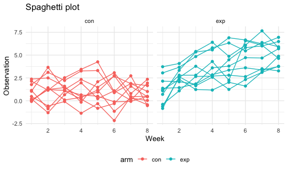

p8105_hw5_xl3371
================
Xuer Liu
2023-11-15

## Problem 2

``` r
full_df = 
  tibble(
    files = list.files("./data/"),
    path = str_c("./data/", files)
  ) %>%
  mutate(data = map(path, read_csv)) %>%
  unnest()
```

``` r
tidy_df = 
  full_df %>%
  mutate(
    files = str_replace(files, ".csv", ""),
    arm = str_sub(files, 1, 3)) %>%
  pivot_longer(
    week_1:week_8,
    names_to = "week",
    values_to = "observation",
    names_prefix = "week_") %>%
  select(arm, subject_id = files, week, observation) %>%
  mutate(week = as.numeric(week))
```

``` r
tidy_df %>%
  ggplot(aes(x = week, y = observation, group = subject_id, color = arm)) + 
  geom_point() + 
  geom_path() + 
  labs(title = "Spaghetti plot",
       x = "Week",
       y = "Observation") +
  facet_grid(~arm) 
```



## Problem 3

``` r
set.seed(371)

sim_t_test = function(mu){
  sim_data =
  tibble(rnorm(n = 30, mean = mu, sd = 5)) 
  
  result = 
    t.test(sim_data) %>%
    broom::tidy() %>%
    select(estimate, p.value)
  return(result)
}
  
mu_0 =
  expand_grid(
    mu = 0,
    iter = 1:5000
  ) %>%
  mutate(t_test_df = map(mu, sim_t_test)) %>%
  unnest(t_test_df)
```

``` r
# Repeat the above for mu={1,2,3,4,5,6}
mu_repeat =
  expand_grid(mu = 1:6, iteration = 1:5000) %>%
  mutate(t_test_df = map(mu, sim_t_test)) %>%
  unnest(t_test_df)
```
